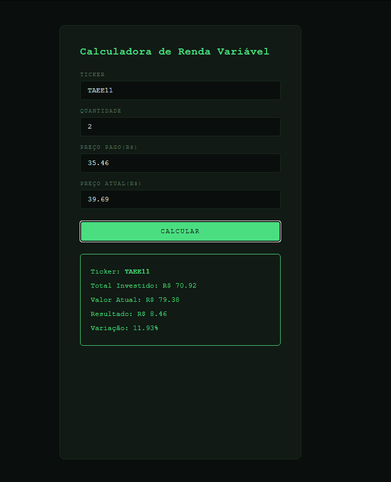

# 📈 Capital Compass — Variable Income Calculator

> PT-BR version below ↓

A variable income portfolio manager to track stocks and REITs, calculate weighted average price, dividend yield, and monthly income estimates.

---

## 🖥️ Preview



---

## ✨ Features

- **Weighted average price** — supports multiple purchases of the same asset at different prices
- **Portfolio table** — all assets displayed with key metrics in one view
- **Profit / Loss** — real-time result and percentage change per asset
- **Dividend Yield** — annualized DY calculated from dividend per share/unit
- **Monthly income estimate** — based on dividends and total quantity held
- **localStorage persistence** — portfolio is saved and reloaded automatically on page open
- **Portfolio reset** — clears all data with confirmation prompt
- Dark mode interface with financial terminal aesthetics

---

## 🚀 How to use

1. Enter the asset **ticker** (e.g. PETR4, MXRF11)
2. Enter the **quantity** of shares / units
3. Enter the **average price paid** per share
4. Enter the **current market price**
5. Optionally enter the **dividend per share/unit** for income estimates
6. Click **Calculate** — the asset is added to the portfolio table
7. Repeat for each asset in your portfolio

---

## 🧮 Formulas

```
Total Invested   = Quantity × Price Paid
Current Value    = Quantity × Current Price
Profit / Loss    = Current Value - Total Invested
Change (%)       = ((Current Price - Avg Price) / Avg Price) × 100

Monthly Income   = Dividend per Unit × Total Quantity
Annual Income    = Monthly Income × 12
Dividend Yield   = (Dividend × 12 / Avg Price) × 100
```

---

## 🛠️ Tech stack

| Technology | Usage |
|---|---|
| HTML5 | Semantic form and table structure |
| CSS3 | Dark mode styling with CSS Variables |
| JavaScript | DOM manipulation, calculations, state management |
| localStorage | Client-side data persistence |

No frameworks. No external libraries. Pure vanilla JS.

---

## 📁 Project structure

```
capital-compass/
├── index.html      # Form, portfolio table, reset button
├── style.css       # Dark mode — green terminal aesthetic
├── script.js       # All logic: calculations, rendering, persistence
└── README.md       # Documentation
```

---

## 📚 What I learned building this

- DOM manipulation with `getElementById`, `addEventListener`, `innerHTML`
- String to number conversion with `parseFloat()` and `isNaN()` validation
- Dynamic HTML table rendering with `Object.keys()` and `forEach()`
- CSS Variables for a consistent, maintainable color system
- Weighted average price using `Array.reduce()`
- Client-side data persistence with `localStorage`, `JSON.stringify` and `JSON.parse`
- State management using a plain JavaScript object as a data store
- Conditional CSS class switching for visual feedback

---

## 🗺️ Roadmap

- [x] Single asset average price calculation
- [x] Positive / negative visual feedback
- [x] Multiple purchases with weighted average price
- [x] Dividend Yield and monthly income estimate
- [x] Portfolio table with all assets
- [x] localStorage persistence
- [x] Portfolio reset
- [ ] Global dashboard (total equity, total income, avg DY)
- [ ] Individual asset deletion
- [ ] Real-time price update via API (Brapi)
- [ ] Portfolio composition chart (Chart.js)
- [ ] CSV export

---

## 👤 Author

**Leonardo** — Software Engineering student at FIAP, transitioning into tech with a focus on web development and cybersecurity.

[](https://github.com/LeoGB1409)
[](https://linkedin.com/in/seu-usuario)

---

> *"The market is a device for transferring money from the impatient to the patient."* — Warren Buffett

---
---

# 📈 Capital Compass — Calculadora de Renda Variável

Gerenciador de carteira de renda variável para acompanhar ações e FIIs, calcular preço médio ponderado, dividend yield e estimativa de renda mensal.

---

## ✨ Funcionalidades

- **Preço médio ponderado** — suporta múltiplas compras do mesmo ativo em preços diferentes
- **Tabela de carteira** — todos os ativos com métricas em uma única visualização
- **Lucro / Prejuízo** — resultado e variação percentual em tempo real
- **Dividend Yield** — DY anualizado calculado a partir do dividendo por cota
- **Estimativa de renda mensal** — baseada nos dividendos e na quantidade total
- **Persistência com localStorage** — carteira salva e recarregada automaticamente
- **Reset da carteira** — apaga todos os dados com confirmação
- Interface dark mode com estética de terminal financeiro

---

## 🚀 Como usar

1. Digite o **ticker** do ativo (ex: PETR4, MXRF11)
2. Informe a **quantidade** de ações / cotas
3. Informe o **preço médio pago** por ação
4. Informe o **preço atual** de mercado
5. Opcionalmente informe o **dividendo por cota** para estimativa de renda
6. Clique em **Calcular** — o ativo é adicionado à tabela
7. Repita para cada ativo da carteira

---

## 📚 O que aprendi construindo

- Manipulação do DOM com `getElementById`, `addEventListener`, `innerHTML`
- Conversão de string para número com `parseFloat()` e validação com `isNaN()`
- Renderização dinâmica de tabela com `Object.keys()` e `forEach()`
- CSS Variables para sistema de cores consistente
- Preço médio ponderado com `Array.reduce()`
- Persistência local com `localStorage`, `JSON.stringify` e `JSON.parse`
- Gerenciamento de estado com objeto JavaScript como banco de dados
- Troca condicional de classes CSS para feedback visual

---

## 🗺️ Roadmap

- [x] Cálculo de preço médio por ativo
- [x] Feedback visual positivo/negativo
- [x] Múltiplas compras com preço médio ponderado
- [x] Dividend Yield e renda mensal estimada
- [x] Tabela de carteira com todos os ativos
- [x] Persistência com localStorage
- [x] Reset da carteira
- [ ] Dashboard global (patrimônio total, renda total, DY médio)
- [ ] Exclusão individual de ativos
- [ ] Atualização de preço via API (Brapi)
- [ ] Gráfico de composição da carteira (Chart.js)
- [ ] Exportação em CSV
